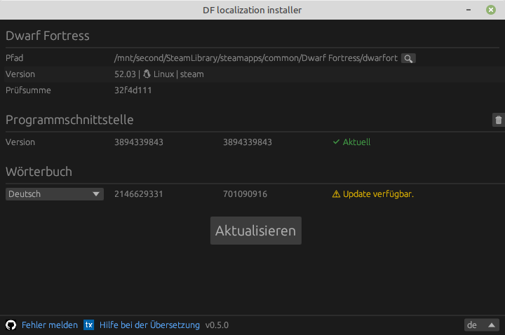

### Lokalisierung für 50.* und neuere Versionen von Dwarf Fortress

> Es gibt eine Unterstützung für DF 51.01 Betas (mit Abenteuermodus)

Laden Sie das Lokalisierungsinstallationsprogramm herunter (unterstützt Version DF 50.10 und neuer):

Kurzanleitung:

- Laden Sie das Paket herunter (drücken Sie die Schaltfläche oben, laden Sie das Paket `win` für Windows oder `lin` für Linux herunter), entpacken Sie es und führen Sie die Datei `dfint-installer` aus.
- Wählen Sie die ausführbare Datei des Spiels aus (`Dwarf Fortress.exe` oder `dwarfort`). Alternativ können Sie die Datei `dfint-installer` in das Verzeichnis des Spiels legen. Anschließend findet sie die ausführbare Datei des Spiels von selbst.
- Wählen Sie die Übersetzungssprache und drücken Sie dann auf „Aktualisieren“.
- Führen Sie das Spiel aus.
- Um die Übersetzung oder Konfiguration für eine neuere Version des Spiels zu aktualisieren, führen Sie das Installationsprogramm erneut aus (während das Spiel beendet ist) und drücken Sie dann auf „Aktualisieren“.

Wenn Sie Probleme mit dem Installationsprogramm haben (z. B. wenn Sie Windows 7 oder 8 verwenden), können Sie stattdessen den [package-builder](https://dfint-package-build.streamlit.app) verwenden.

### Links

- [Übersetzungsprojekt auf Transifex](https://app.transifex.com/dwarf-fortress-translation/dwarf-fortress-steam) - hier können Sie an der Übersetzung des Spiels in Ihre Sprache teilnehmen.
- [Das Projekt auf GitHub](https://github.com/dfint) - hier entwickeln wir Tools für die Lokalisierung
- [Die offizielle Dwarf Fortress-Site](https://bay12games.com/dwarves/), [steam](https://store.steampowered.com/app/975370/Dwarf_Fortress/), [itch.io](https://kitfoxgames.itch.io/dwarf-fortress)

