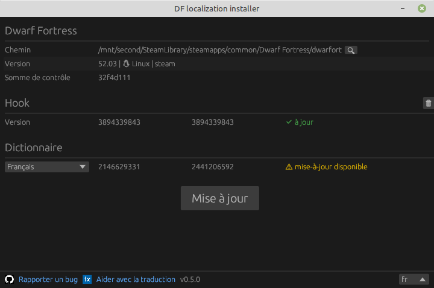

### Localisation pour la version 50.* et plus récentes de Dwarf Fortress

Téléchargez l'installateur de localisation (compatible avec la version DF 50.10 et plus récentes) :

Quelques instructions sur l'installation des traductions:

- Télécharger le paquet (appuyer sur le bouton au dessus, télécharger le paquet `win` pour windows, ou `lin` pour linux), décompresser le, et exécuter le fichier `dfint-installer`.
- Sélectionnez (« Ouvrir ») le fichier exécutable du jeu (`Dwarf Fortress.exe` ou `dwarfort`). Vous pouvez également placer le fichier `dfint-installer` dans le répertoire du jeu, ce qui lui permettra de trouver automatiquement l'exécutable du jeu.
- Choisissez la langue de traduction, puis appuyez sur « Mettre à jour ».
- Exécuter le jeu
- Pour mettre à jour la traduction ou la configuration pour une nouvelle version du jeu, relancez l'installateur (avec le jeu fermé), puis appuyez sur « Mettre à jour ».

Si vous rencontrez des problèmes avec l'installateur (par exemple, si vous utilisez Windows 7 ou 8), vous pouvez utiliser le [package-builder](https://dfint-package-build.streamlit.app) à la place.

### Liens

- [Translation project on transifex](https://app.transifex.com/dwarf-fortress-translation/dwarf-fortress-steam) - vous pouvez y participer pour traduire le jeu dans votre langue
- [Le projet sur github](https://github.com/dfint) - c'est l'endroit où nous développons des outils pour la localisation
- [Le site officiel de Dwarf Fortress](https://bay12games.com/dwarves/), [steam](https://store.steampowered.com/app/975370/Dwarf_Fortress/), [itch.io](https://kitfoxgames.itch.io/dwarf-fortress)

