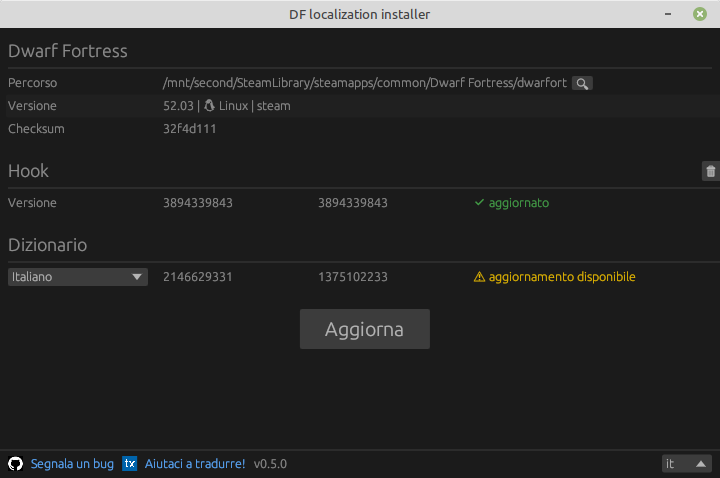

L'installer di localizzazione supporta le versioni di DF dalla 50.10 in poi, incluse le versioni 51 e 52.

Istruzioni brevi su come installare la traduzione:

- Scarica l'installer, estrailo, esegui il file `dfint-installer`.
- Seleziona ("Apri") il file eseguibile del gioco (`Dwarf Fortress.exe` o `dwarfort`). In alternativa, puoi mettere il file `dfint-installer` nella directory del gioco, così troverà l'eseguibile da solo.
- Scegli la lingua della traduzione, poi premi "Aggiorna".
- Avvia il gioco.
- Per aggiornare la traduzione o la configurazione per una versione più recente del gioco, esegui di nuovo l'installer (a gioco chiuso) e premi "Aggiorna".

Se hai problemi con l'installer (ad esempio, stai usando Windows 7 o 8), puoi usare invece il [package-builder](https://dfint-package-build.streamlit.app){:target="_blank"}.

{:.centered}

### Link

- [Progetto di traduzione su transifex](https://app.transifex.com/dwarf-fortress-translation/dwarf-fortress-steam) - qui puoi partecipare alla traduzione del gioco in italiano
- [Il progetto su github](https://github.com/dfint) - questo è il luogo dove sviluppiamo gli strumenti per la localizzazione
- [Il sito ufficiale di Dwarf Fortress](https://bay12games.com/dwarves/), [steam](https://store.steampowered.com/app/975370/Dwarf_Fortress/), [itch.io](https://kitfoxgames.itch.io/dwarf-fortress)

