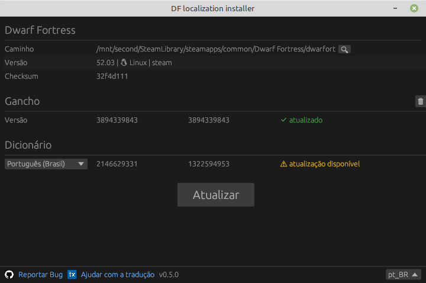

### Localização para 50.* e novas versões de Dwarf Fortress

Baixe o instalador de localização (compatível com a versão do DF 50.10 e mais recentes, incluindo as versões 51):

Breves instruções de como instalar a tradução:

- Baixe o pacote (pressione o botão acima, baixe o pacote `win` para Windows ou `lin` para Linux), descompacte-o e execute o arquivo `dfint-installer`.
- Selecione (“Abrir”) o arquivo executável do jogo (`Dwarf Fortress.exe` ou `dwarfort`). Como alternativa, você pode colocar o arquivo `dfint-installer` no diretório do jogo para que ele próprio encontre o executável do jogo.
- Escolha o idioma da tradução e pressione “Atualizar”.
- Execute o jogo.
- Para atualizar a tradução ou a configuração para uma versão mais recente do jogo, execute o instalador novamente (enquanto o jogo estiver desligado) e pressione "Atualizar".

Se você tiver problemas com o instalador (por exemplo, se estiver usando o Windows 7 ou 8), em vez disso, poderá usar o [package-builder](https://dfint-package-build.streamlit.app).

### Links

- [Projeto de tradução na transifex](https://app.transifex.com/dwarf-fortress-translation/dwarf-fortress-steam) - aqui você pode participar da tradução do jogo para o seu idioma
- [O projeto no github](https://github.com/dfint) - este é um local onde desenvolvemos ferramentas para a localização
- [Site oficial do Dwarf Fortress](https://bay12games.com/dwarves/), [steam](https://store.steampowered.com/app/975370/Dwarf_Fortress/), [itch.io](https://kitfoxgames.itch.io/dwarf-fortress)

