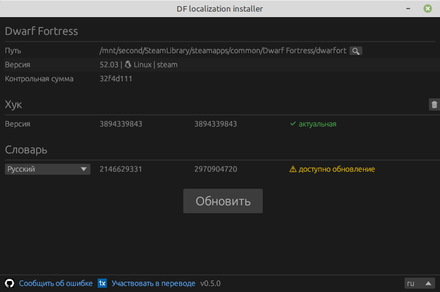

### Русификатор для 50.* и более новых версий Dwarf Fortress

Скачать установщик локализации (поддерживает версии DF от 50.10 и новее, включая 51 и 52 версии):

> Версия для Windows:
> [{{ site.data.release_assets.windows.name }}]({{ site.data.release_assets.windows.url }})  
> Версия для Linux:
> [{{ site.data.release_assets.linux.name }}]({{ site.data.release_assets.linux.url }})

Краткая инструкция по установке перевода:

- Скачайте архив, распакуйте, запустить файл `dfint-installer`.
- Выберите ("Откройте") исполняемый файл игры (`Dwarf Fortress.exe` или `dwarfort`). Можно положить файл `dfint-installer` в папку игры, тогда не нужно будет при первом запуске указывать путь к исполняемому файлу.
- Выберите язык перевода, нажать "Обновить" ("Update").
- Запустите игру.
- Для обновления перевода/конфигурации для более новых версий игры — запустите инсталлятор снова (при закрытой игре), нажать "Обновить"

Если инсталлер по какой-то причине не работает (например, у вас Windows 7 или 8), как альтернативу можно использовать [package-builder](https://dfint-package-build.streamlit.app){:target="_blank"}.

### Ссылки

- [Проект перевода на transifex](https://app.transifex.com/dwarf-fortress-translation/dwarf-fortress-steam) - здесь вы можете принять участие в доработке перевода игры на русский язык
- [Проект на github](https://github.com/dfint) - здесь ведется разработка инструментов для локализации
- [Официальный сайт Dwarf Fortress](https://bay12games.com/dwarves/), [steam](https://store.steampowered.com/app/975370/Dwarf_Fortress/), [itch.io](https://kitfoxgames.itch.io/dwarf-fortress)

