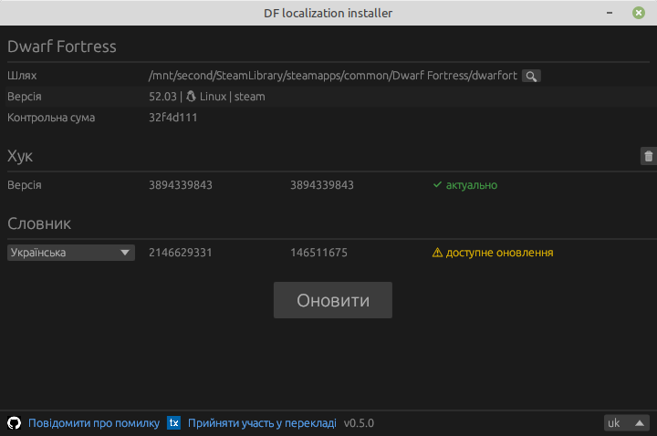

### Українізатор для 50.* і новіших версій Dwarf Fortress

Завантажити інсталятор локалізації (підтримується DF 50.10 і новіші версії, включаючи 51 і 52 версії):

{:target="_blank"}

Коротка інструкція по установці перекладу:

- Завантажте пакет (натисніть кнопку вище, завантажте пакет `win` для windows або `lin` для linux), розпакуйте його, запустіть файл `dfint-installer`.
- Виберіть («Відкрийте») виконуваний файл гри (`Dwarf Fortress.exe` або `dwarfort`). Також ви можете помістити файл `dfint-installer` у каталог гри, тоді він сам знайде виконуваний файл гри.
- Виберіть мову перекладу, потім натисніть «Оновити».
- Запустіть гру.
- Щоб оновити переклад або конфігурацію для новішої версії гри, знову запустіть інсталятор (поки гра закрита), а потім натисніть «Оновити».

Якщо у вас виникли проблеми з інсталятором (наприклад, ви користуєтеся Windows 7 або 8), замість цього можна скористатися [package-builder](https://dfint-package-build.streamlit.app){:target="_blank"}.

### Посилання

- [Проєкт перекладу на transifex](https://app.transifex.com/dwarf-fortress-translation/dwarf-fortress-steam) - тут ви можете долучитись до перекладу Dwarf Fortress на українську мову
- [Проєкт на github](https://github.com/dfint) - це місце, де ми розробляємо інструменти для локалізації
- [Офіційний сайт Dwarf Fortress](https://bay12games.com/dwarves/), [steam](https://store.steampowered.com/app/975370/Dwarf_Fortress/), [itch.io](https://kitfoxgames.itch.io/dwarf-fortress)

